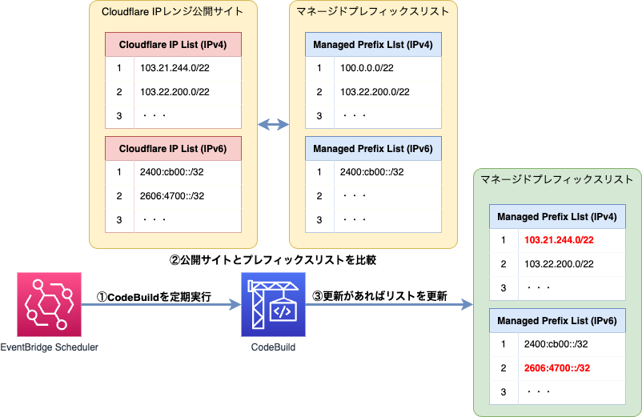

# Cloudflare使用IPレンジのプレフィックスリスト定期更新処理

処理の詳細は以下を参照。

- [Cloudflareの使用IPレンジのプレフィックスリストを定期的に更新する処理を導入する。](https://qiita.com/sakai00kou/items/7da6eab4a39f119776c4)

## 構成概要

## 各リソースの用途

|リソース|使用用途|備考|
|:--|:--|:--|
|EventBridge Scheduler|指定時間にCodeBuildの実行|CodeBuildを実行する時間を指定|
|CodeBuild|Cloudflare使用IPリスト情報の取得 Managed Prefix Listの更新|ログはCloudWatch Logsに格納|
|Managed Prefix List|Cloudflare使用IPリストの格納|IPv4、IPv6それぞれのリストを作成|

## 修正するファイル

|ファイル名|設定内容|
|:--|:--|
|_local_variables.tf|各種リソース名等を指定|

## 基本設定

リソース名等は`_local_variables.tf`にまとまっているため、導入するシステムに合わせて変更すること。
